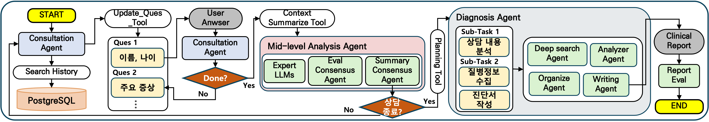

# Agentic Ophtimus : Multi-Agent Ophthalmology Diagnosis System


## Introduction

Agentic Ophtimus is a multi-agent AI system for ophthalmological diagnosis.

The system conducts structured patient consultations, coordinates a panel of AI expert agents powered by different frontier LLMs (GPT-4o, Claude Sonnet, Gemini), and produces comprehensive diagnostic reports with quality evaluation. A RAG pipeline grounds agent reasoning in curated clinical guidelines for cataract, glaucoma, conjunctivitis, dry eye disease, and retinal diseases.

<p align="left">
  
</p>

## System Architecture

The diagnostic workflow is orchestrated via a **LangGraph StateGraph**, progressing through distinct stages:

```
[Patient Input]
       │
       ▼
 consultation_agent  ◄──────────────────┐
       │                                │
 patient_response  (interrupt)          │
       │                                │
 summarize_consultation                 │
       │                                │
       ▼                                │
   supervisor                           │
  ├─ expert_agent_1  (GPT-4o)           │
  ├─ expert_agent_2  (Claude Sonnet)    │
  └─ expert_agent_3  (Gemini 2.0 Flash) │
       │                                │
 evaluate_consensus_agent               │
       │                                │
       ├─ [More info needed] ───────────┘
       │
       └─ [Consensus reached]
                │
          diagnosis_agent
                │
       ┌────────┼────────┐
  deep_search  analysis  organize
       └────────┼────────┘
           write_agent
                │
         report_evaluator  (LLM-as-Judge)
                │
               END
```

## Agent Details

| Agent | Role |
|-------|------|
| Consultation Agent | 구조화된 질문 목록을 기반으로 환자의 증상, 병력, 인구통계 정보를 단계적으로 수집하고 PostgreSQL에서 과거 진료 기록을 조회 |
| Supervisor | 전문가 에이전트들의 분석 작업을 조율하고 결과를 취합하여 합의 평가 단계로 워크플로우를 제어 |
| Expert Agent 1 | GPT-4o 기반의 독립적 전문가로서 예상 질환, 추론 근거, 추가 필요 정보를 포함한 구조화된 의견(ExpertOpinion) 생성 |
| Expert Agent 2 | Claude Sonnet 기반의 독립적 전문가로서 다른 모델 관점의 감별 진단 및 임상적 추론 제공 |
| Expert Agent 3 | Gemini 2.0 Flash 기반의 독립적 전문가로서 세 번째 관점의 의견을 추가해 다각적 합의 형성에 기여 |
| Consensus Evaluator | 세 전문가의 의견을 비교 분석하여 합의 여부를 판단하고, 추가 문진 필요 시 consultation_agent로 재분기 |
| Deep Search Agent | ChromaDB RAG 파이프라인과 Tavily 웹 검색을 활용하여 관련 임상 가이드라인 및 의학 문헌 수집 |
| Analysis Agent | 수집된 가이드라인과 전문가 의견을 종합 분석하여 진단 근거 도출 |
| Organize Agent | 분석 결과를 진단 리포트 구조에 맞게 정리하고 각 섹션별 내용을 체계화 |
| Write Agent | 정리된 분석 결과를 바탕으로 최종 진단 리포트를 의학적 표준 형식에 따라 작성 |
| Report Evaluator | LLM-as-Judge 패턴으로 최종 리포트의 근거 품질, 임상 완전성, 환각 위험도 등 5개 기준을 평가하고 등급(A/B/C/D) 부여 |

### Report Evaluation Criteria

Report Evaluator는 최종 진단 리포트를 아래 5개 기준으로 평가하고 종합 등급(A/B/C/D)을 부여합니다.

| Criterion | Description |
|-----------|-------------|
| `evidence_quality` | 임상 근거의 신뢰성 및 출처 적절성 |
| `clinical_completeness` | 진단에 필요한 정보의 완전성 |
| `hallucination_risk` | LLM 환각(hallucination) 위험도 |
| `clinical_utility` | 실제 임상 현장에서의 활용 가능성 |
| `structure_completeness` | 리포트 구조 및 형식의 완전성 |

## Project Structure

```
Multi-Agent-Ophthalmologist/
├── api/                          # FastAPI 백엔드
│   ├── main.py                   # 앱 초기화 및 라이프사이클 관리
│   ├── config.py                 # 환경 설정 (DB, API 키, CORS)
│   ├── dependencies.py           # 의존성 주입 (그래프, 세션 스토어)
│   ├── routers/                  # REST API 엔드포인트
│   │   ├── sessions.py           # 세션 생성, 응답, 대화 기록
│   │   ├── reports.py            # 진단 리포트 조회
│   │   └── health.py             # 헬스 체크
│   ├── middleware/
│   │   └── logging.py            # 요청 로깅 미들웨어
│   └── schemas/                  # Pydantic 스키마
│       ├── session.py
│       └── report.py
├── app/                          # LangGraph 에이전트 & 핵심 로직
│   ├── graph.py                  # StateGraph 워크플로우 정의
│   ├── state.py                  # 상태 정의 (MainState, DeepAgentState)
│   ├── prompts.py                # 전체 에이전트 시스템 프롬프트
│   ├── node/                     # 그래프 노드 (에이전트)
│   │   ├── consultation_agent.py
│   │   ├── patient_response.py
│   │   ├── summarize_consultation.py
│   │   ├── mid_level_analysis.py
│   │   ├── diagnosis_agent.py
│   │   ├── report_evaluator.py
│   │   ├── deep_search_agent.py
│   │   ├── analysis_agent.py
│   │   ├── organize_agent.py
│   │   └── write_agent.py
│   ├── tools/                    # 도구 모듈
│   │   ├── guideline_rag.py      # ChromaDB RAG (임상 가이드라인)
│   │   └── patient_similarity.py # 유사 환자 검색
│   ├── database/
│   │   ├── connection.py         # PostgreSQL 연결
│   │   └── models.py             # PatientRecord ORM 모델
│   └── utils/
│       ├── logger.py
│       ├── todo_tools.py
│       └── subagent_calling_tool.py
├── main.py                       # CLI 데모 진입점
├── run_server.py                 # Uvicorn 서버 시작
├── requirements.txt
└── .env_sample                   # 환경 변수 샘플
```

## Quickstart

### 1. Install Dependencies

```bash
git clone https://github.com/BaekSeungJu/Multi-Agent-Ophthalmologist.git
cd Multi-Agent-Ophthalmologist
pip install -r requirements.txt
```

### 2. Environment Setup

`.env_sample`을 `.env`로 복사하고 필요한 값을 입력합니다.

```bash
cp .env_sample .env
```

| Variable | Description |
|----------|-------------|
| `OPENAI_API_KEY` | OpenAI API 키 (GPT-4o 에이전트, 임베딩) |
| `ANTHROPIC_API_KEY` | Anthropic API 키 (Claude Sonnet 전문가 에이전트) |
| `GOOGLE_API_KEY` | Google AI API 키 (Gemini 2.0 Flash 전문가 에이전트) |
| `TAVILY_API_KEY` | Tavily 웹 검색 API 키 |
| `DATABASE_URL` | PostgreSQL 연결 URL |
| `LANGCHAIN_API_KEY` | LangSmith 추적 키 (선택 사항) |
| `LANGCHAIN_TRACING_V2` | LangSmith 추적 활성화 여부 (`true`/`false`) |

### 3. Database Setup

PostgreSQL 데이터베이스를 생성하고 연결 URL을 `.env`에 설정합니다.

```bash
# PostgreSQL에서 데이터베이스 생성
createdb ophtimus_db
```

서버 최초 시작 시 ORM 모델에 따라 테이블이 자동으로 생성됩니다.

### 4. Index Guidelines

임상 가이드라인을 ChromaDB에 인덱싱합니다. 서버 시작 시 자동으로 실행되지만, 수동으로도 실행할 수 있습니다.

```bash
python scripts/index_guidelines.py
```

### 5. Run Server

```bash
python run_server.py
```

서버가 시작되면 `http://localhost:8000`에서 접근 가능합니다.
- **API 문서**: `http://localhost:8000/docs` (Swagger UI)
- **프론트엔드**: `http://localhost:8000`

### 6. API Usage

**새 진단 세션 생성**

```bash
curl -X POST http://localhost:8000/sessions \
  -H "Content-Type: application/json"
```

응답 예시:
```json
{
  "session_id": "abc123",
  "question": "안녕하세요. 먼저 이름과 나이를 알려주시겠어요?",
  "status": "consulting"
}
```

**환자 응답 제출**

```bash
curl -X POST http://localhost:8000/sessions/{session_id}/answer \
  -H "Content-Type: application/json" \
  -d '{"answer": "홍길동, 45세입니다."}'
```

**진단 리포트 조회**

```bash
curl http://localhost:8000/sessions/{session_id}/report
```

### 7. CLI Demo

그래프 워크플로우를 로컬에서 직접 실행하여 동작을 확인할 수 있습니다.

```bash
python main.py [thread_id]
```

- `thread_id`를 생략하면 자동으로 새 세션 ID가 생성됩니다.
- 실행 로그는 `logs/` 디렉토리에 저장됩니다.

## API Reference

| Endpoint | Method | Description |
|----------|--------|-------------|
| `/sessions` | `POST` | 새 진단 세션 생성 및 첫 번째 문진 질문 반환 |
| `/sessions/{id}` | `GET` | 세션 상태 조회 |
| `/sessions/{id}/answer` | `POST` | 환자 응답 제출 및 다음 질문 반환 |
| `/sessions/{id}/conversation` | `GET` | 전체 대화 기록 조회 |
| `/sessions/{id}/report` | `GET` | 최종 진단 리포트 및 평가 점수 조회 |
| `/health` | `GET` | 헬스 체크 |

| Service | Port | Description |
|---------|------|-------------|
| FastAPI + SPA | 8000 | API 게이트웨이 및 프론트엔드 |
| PostgreSQL | 5432 | 환자 기록 저장소 |
| ChromaDB | - | 임상 가이드라인 벡터 스토어 (로컬 파일) |
